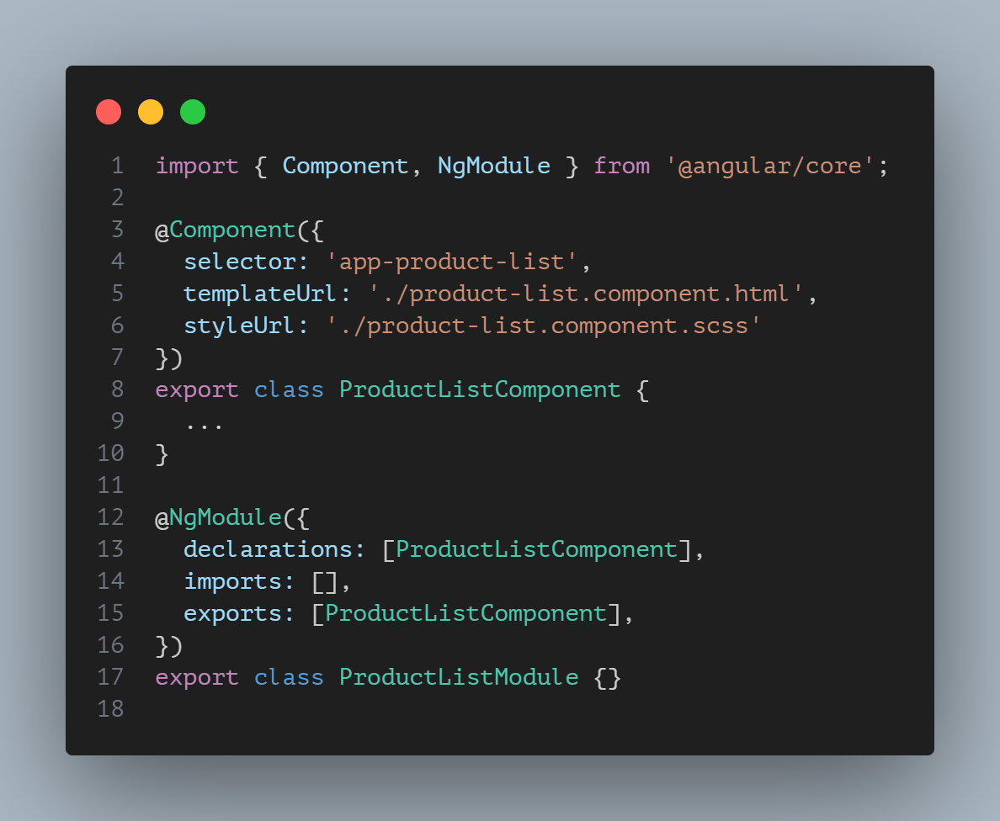
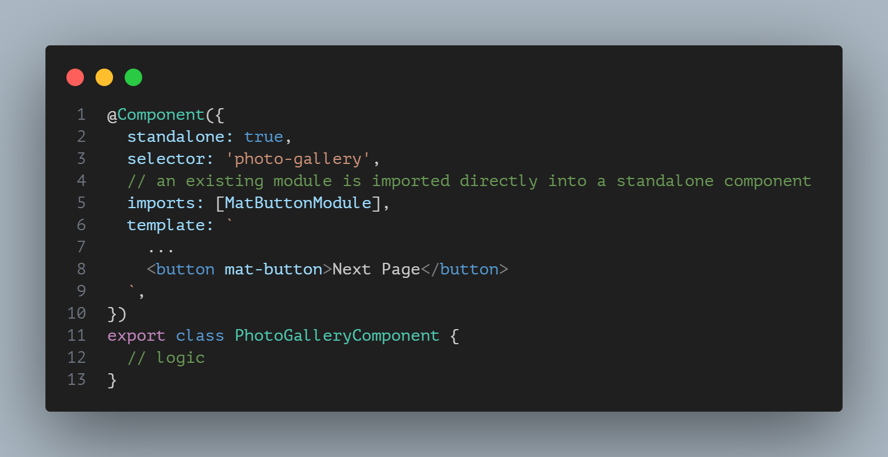
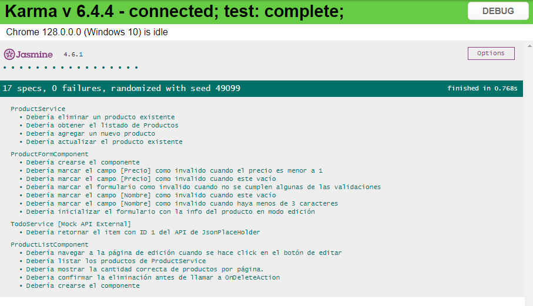

# Prueba Técnica Angular - SILICE

This project was generated with [Angular CLI](https://github.com/angular/angular-cli) version 17.3.8.

## Tecnologías utilizadas
* NodeJS ^18.13.0 || ^20.9.0
* Angular Material
* Angular 17.3.8
* NPM

## Documento propuesto por SILICE

[prueba_tecnica_front_end_position_silice.pdf](./src/docs/prueba_tecnica_angular.pdf)

## Instalación de Dependencias
Run `npm install`

## Módulos y Standalone Components

Se desarrolló bajo una arquitectura modular, aplicando los diferentes
requisitos técnicos solicitados.

Para dar cumplimiento al apartado de LazyLoading sobre los módulos
de creación/edición y detalle del producto, se utilizó el enfoque de Standalone Components (Componentes que no dependen de un módulo) que están
disponibles a partir de la versión 14, si bien es cierto, existe otro 
enfoque para cumplir con ese requerimiento llamado SCAM (adjunto img de dicho enfoque), se optó por trabajar con el enfoque de standalone.

### SCAM

### Standalone Components

## Development server

Run `ng serve` for a dev server. Navigate to `http://localhost:4200/`. The application will automatically reload if you change any of the source files.

## Ejecutando tests unitarios

- Run `ng test` to execute the unit tests via [Karma](https://karma-runner.github.io).
- Chrome

### Resultado final

## Build

Run `ng build` to build the project. The build artifacts will be stored in the `dist/` directory.

## Code scaffolding

Run `ng generate component component-name` to generate a new component. You can also use `ng generate directive|pipe|service|class|guard|interface|enum|module`.

## Further help

To get more help on the Angular CLI use `ng help` or go check out the [Angular CLI Overview and Command Reference](https://angular.io/cli) page.
